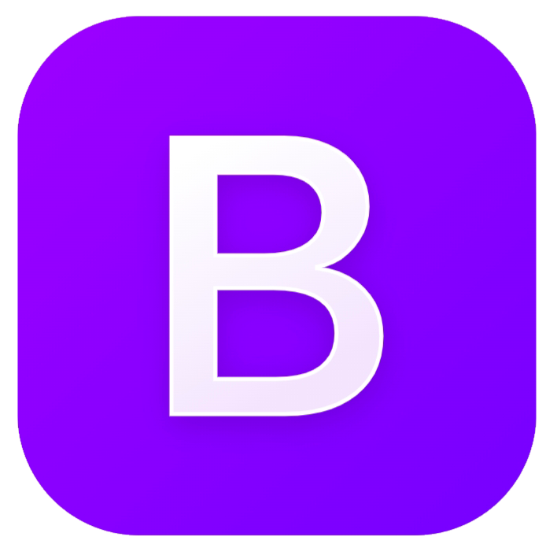
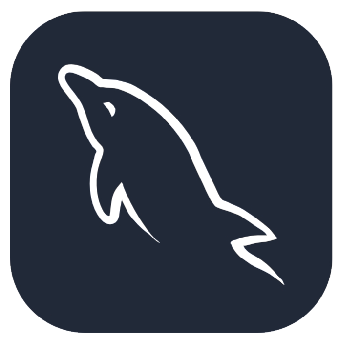
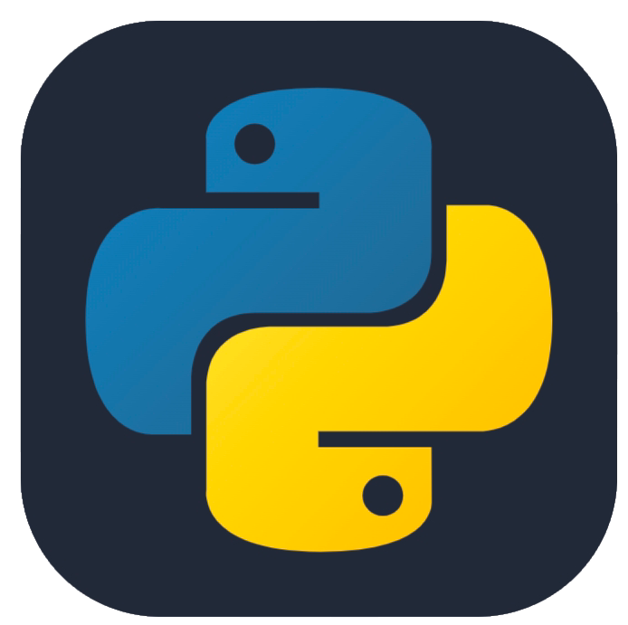
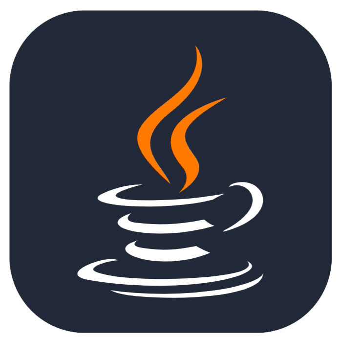
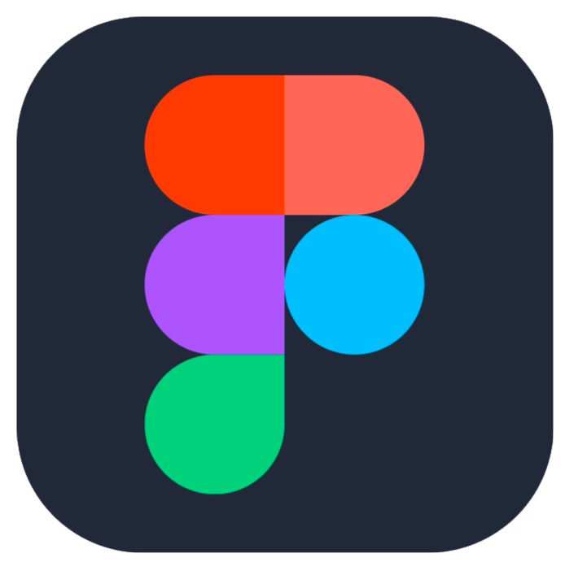

# Halo semuanya👋, saya Stefanie

Saya adalah mahasiswi semester 4 program studi `Sistem Informasi` di `Fakultas Ilmu Komputer dan Rekayasa` [Universitas Multi Data Palembang](https://mdp.ac.id/)

Data | Keterangan
--- | ---
Nama | Stefanie
NPM | 2226240009
Kelas | SI41

---

### Tentang Repositori si41wp1
### Deskripsi
Repositori ini berisi materi-materi praktikum yang diajarkan di mata kuliah Pengembangan Aplikasi Web I. 
File-file dibuat dengan menggunakan HTML, CSS, JavaScript, dan Bootstrap. 
Repositori ini dibuat dengan tujuan untuk menyimpan proyek atau file yang telah dibuat sekaligus untuk berbagi pengetahuan 
mengenai apa yang telah didapatkan di mata kuliah ini. Repositori ini terdiri dari pembelajaran tentang HTML dasar, 
image, form, CSS, Bootstrap, dan dasar JavaScript.

### Instruksi
Untuk mengedit kode ini bisa menggunakan Notepad++, Visual Studio Code, maupun editor lainnya, sedangkan untuk menjalankan kode tersebut 
diperlukan browser seperti Google Chrome dan lainnya.

---
### Tentang Saya

### Hobi :

🎹 Bermain piano

📖 Membaca

🎬 Menonton film

Sekarang saya sedang berada di semester 4. Saya suka mempelajari hal-hal terkait dengan teknologi, khususnya di bidang komputer.
Untuk semester awal, kami mempelajari mata kuliah umum dan dasar-dasar tentang sistem informasi.
Pemrograman juga mulai diperkenalkan pada semester awal.
Pada semester pertengahan, pembelajaran mulai difokuskan tentang sistem informasi termasuk analisis, perancangan, dan penerapannya.
Saat ini saya sedang mempelajari web programming dan Github di mata kuliah Pengembangan Aplikasi Web I.

### Yang sedang dipelajari :

  
  
  
  
  
  

### Yang pernah dipelajari :

  
  
  

### Website Portofolio Pribadi 🌐 : [Klik Disini](https://portofolio-stefanie.vercel.app/)

### Proyek perkuliahan 💡:
* Kegiatan Sosialisasi Pemahaman Pendidikan Anti Korupsi
* Pelatihan Pemanfaatan Google Workspace untuk Kolaborasi Pembelajaran
* Studi Kasus Penerapan Etika Sistem Informasi dan Teknologi Informasi
* Analisis Sistem Informasi Organisasi
* Ide Aplikasi yang Mendukung Penerapan Green (Prototype)
* Ide Aplikasi Inovatif (Prototype)

### Kontak :
* Instagram : [@stefaniee8888](https://www.instagram.com/stefaniee8888?igsh=MWVtYzJ1Zmdwbm1scw==)
* Email : stefanie_2226240009@mhs.mdp.ac.id
